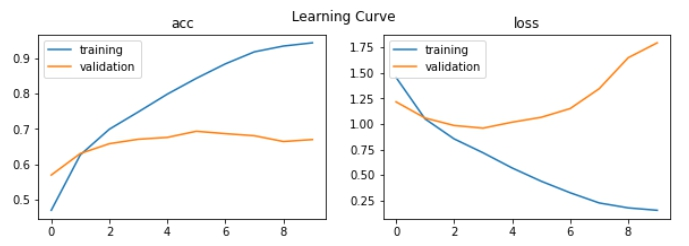
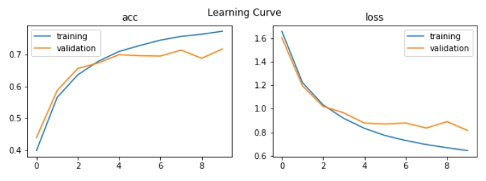
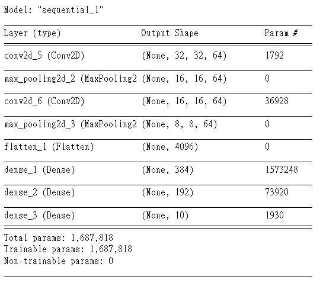
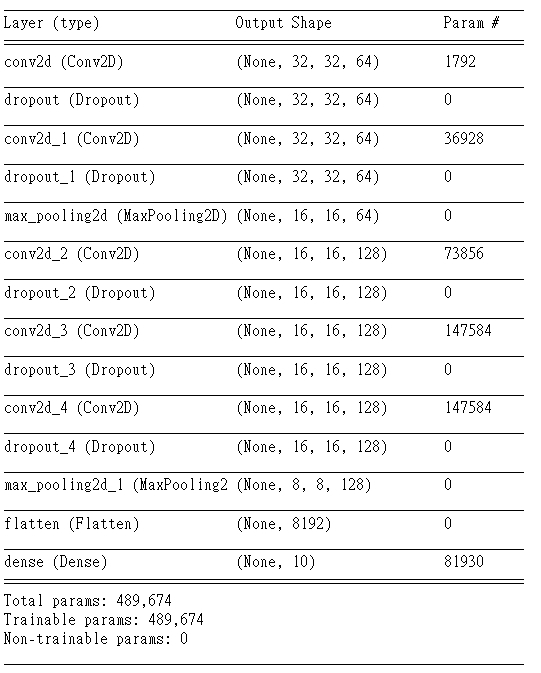

# cifar10

## 筆記

1. 使用原本的架構，有overfitting的可能，準確度約在65%左右，且learning curve不完美(val_loss升高、val_acc沒有上升)。 
   適當的epochs設在5，會有最好的結果。 

2. 為了避免overfitting，加入dropout，並將網路層數加多，發現val_loss有開始往下收斂。 
   適當的epochs設在10，會有最好的結果。 

* 原本的架構 

* 修改完的架構 

3. batch_size=32時有最好的結果，使用過64、128、16等等。
4. 加入dropout後效果很好，避免掉嚴重的overfitting。

## 待解決

1. 一開始val_loss低於train_loss、val_acc高於train_acc 
-> Reason #2: Training loss is measured during each epoch while validation loss is measured after each epoch 
-> 參考: https://www.pyimagesearch.com/2019/10/14/why-is-my-validation-loss-lower-than-my-training-loss/ 
